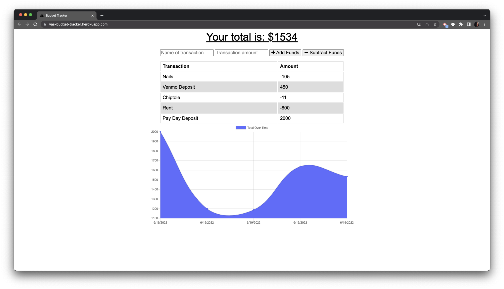

# [PWA Budget Tracker](https://github.com/ysaad01/pwa-budget-tracker)

## Table of Contents

- [Description](#description)
- [Installation](#installation)
- [Usage](#usage)
- [Heroku](#heroku)
- [Screenshot](#screenshot)
- [License](#license)
- [Questions](#questions)

## [Description](#table-of-contents)

Using Progressive Web Application (PWA) this application enables the user to add expenses and deposits to their budget.

The browser Cache API is used to store the application's HTML, CSS, and JavaScript, controlled by a service worker.

## [Installation](#table-of-contents)

- Clone the Github Repository
- Run one of the below commands to install the required libraries:
  - `npm i`
  - `npm install`

## [Usage](#table-of-contents)

Run one of the below commands to start the application:

- `npm start`
- `node server.js`

## [Heroku](#table-of-contents)

This site is currently hosted on [Heroku](https://yas-budget-tracker.herokuapp.com/) and can also be run locally using the files located in the GitHub repository Github.

## [Screenshot](#table-of-contents)

## [License](#table-of-contents)

The application is covered under the following license:

## [Questions](#table-of-contents)

- If you have any questions please [**Email**](mailto:ysaad2325@gmail.com) me Ü
- Check out more of my work at [**GitHub**](https://github.com/ysaad01) Ü
